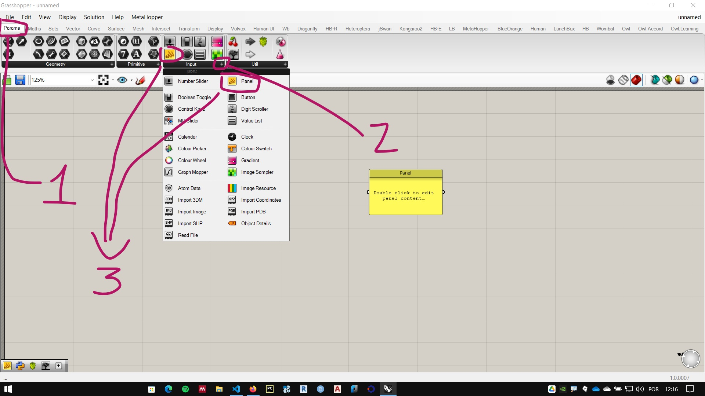
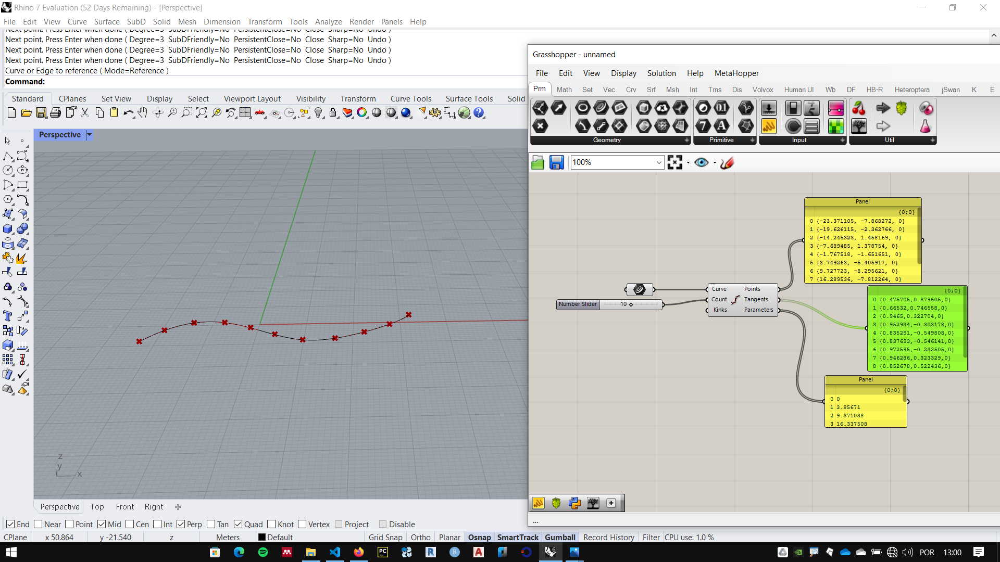
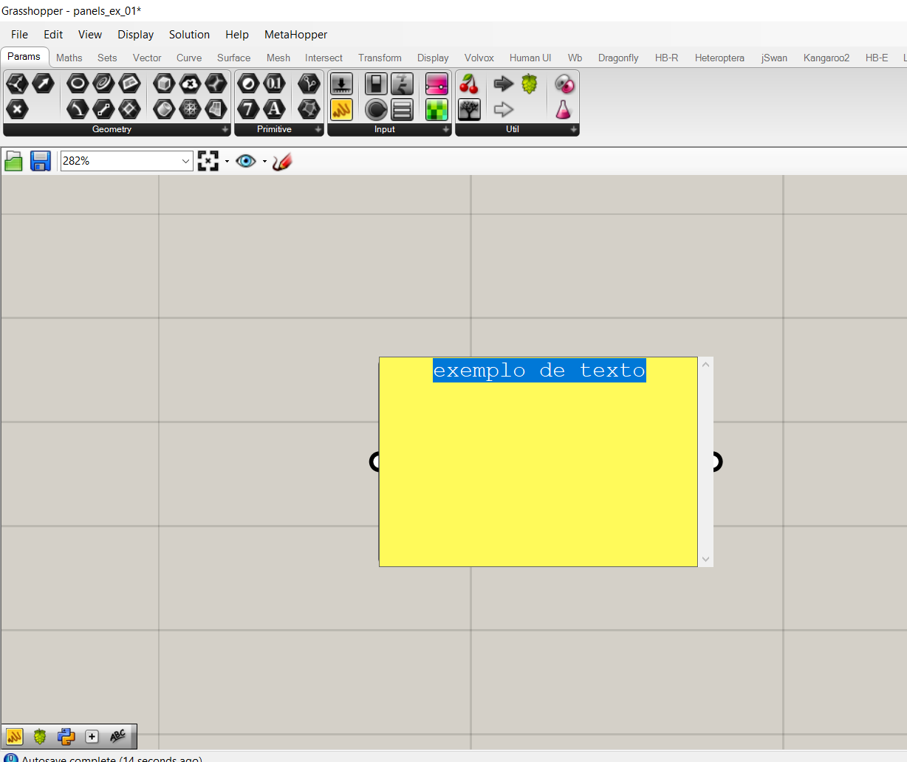
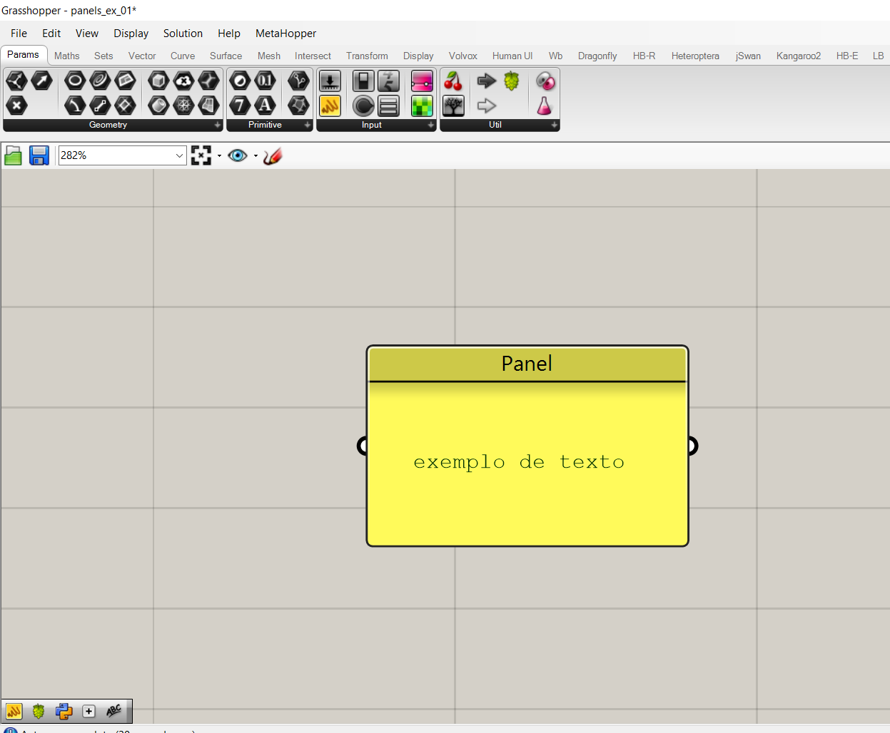
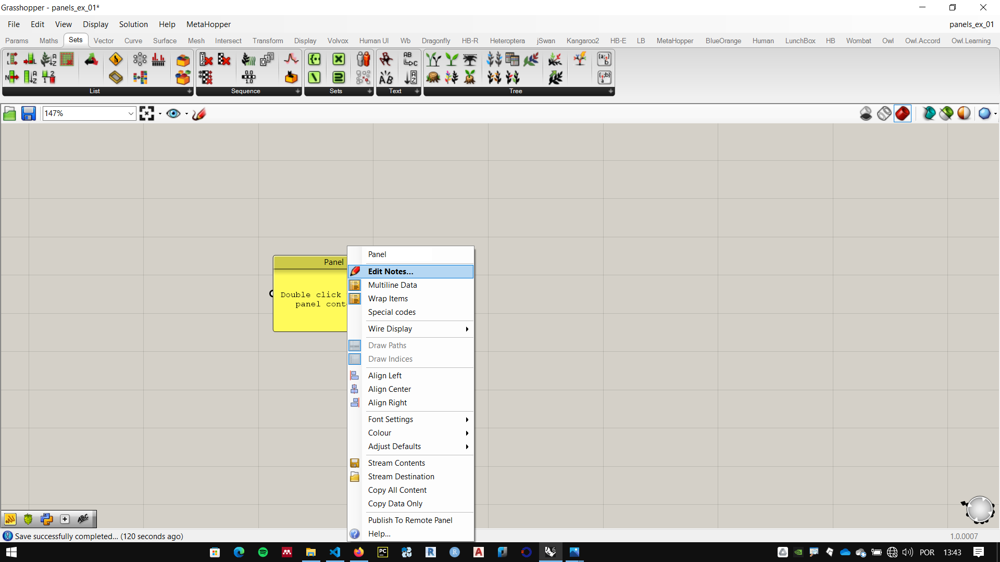
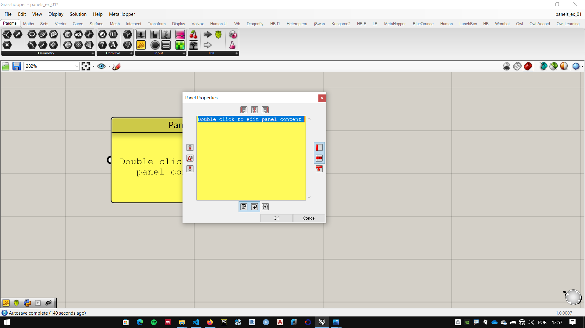
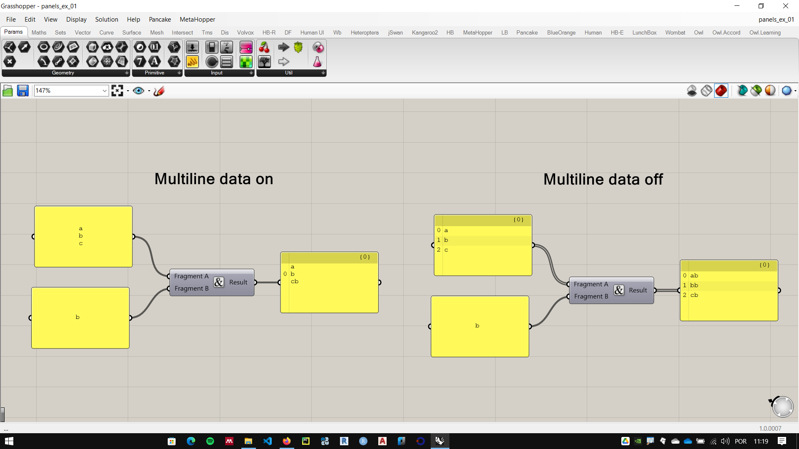

# Panels 

_____________ 

[Sample file](./panels_ex_01.gh) 

__________ 


## What is a panel?

The **panels** (panels) are very popular components of **Grasshopper**, widely used, both for input and for data output in algorithms.

 __________ 
 
## Component location 
 
  
 
 The *Panels* component can be found in the **Params** tab in the **Input** palette. as shown in the figure above. They can also be loaded by shortcut by double-clicking on the screen and typing two division bars:
 
``` Python
//
```

__________

## Panels and data

They feed on data of various types: mostly texts. They can be fed with the output of a component (data output) or have data entered manually (data entry).

### Data output

When you want to see the data from one of the outputs of a component, you connect a panel to this output. in the figure below we see three **panels** connected to each of the outputs of a **Divide Curve** component.



The output **Points** shows on the screen the points that divide the curve, in the panel we see the coordinate values of those same points.

### Data input

Data can be entered manually in different ways:

1. Double-clicking on a **panel** and typing the desired characters. 
   
   
   
2. clicking a right-click **panel** and choosing the **Edit Notes** option !
     
    
3. typing the shortcut ''' // ''', typing the desired text and pressing the **enter** key. 
    


#### Multiline data

 We can insert multiple lines of text and one **panel** by the methods 1 and 2 listed above, using the **enter** key when typing.
 
 Right-clicking a **panel** we see the configuration options. Among them, the **Multiline Data** option is one of the most important and is marked as enabled by default.


In the example below we see the component **concatenate** used with the same inputs, on the left, the **panel** connected to the component '*Fragment A** input is configured with **Multiline data** enabled (default for a new **panel**), in the example on the right, the option is disabled.



The **concatenate** component joins two texts into one. This is a simple operation, but it is widely used in programming languages and important in various computational problems.

In the first example, the component considered the text in **Fragment A** as a single piece of information (a data with multiple lines), placing the text of **Fragment B** after the end of **Fragment A**.

On the right, with **Multiline data** disabled, the component considered that each line of **panel** text was a separate **data** information (a data differed per line). placing the text of **Fragment B** after the end of each line.

____________________
____________________


