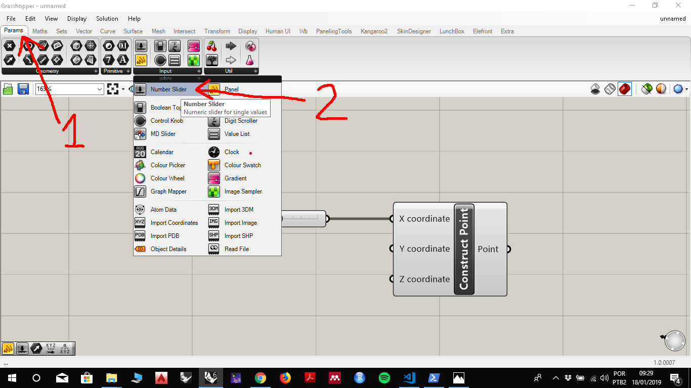
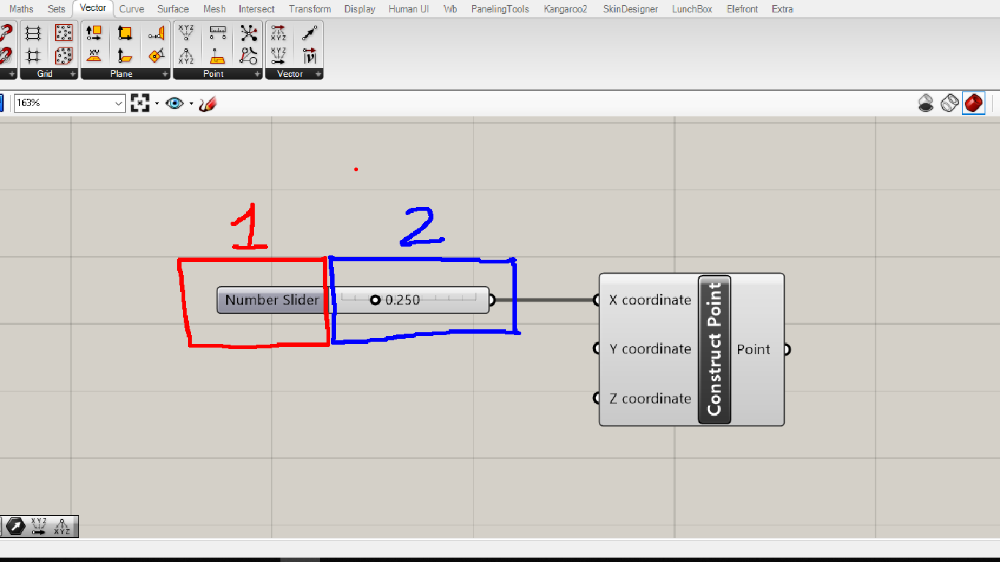
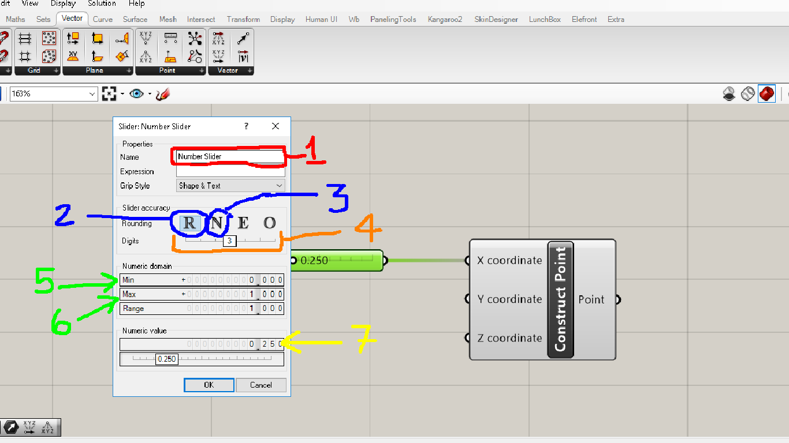

# Sliders

__________

## What is a slider in Grasshopper 

Sliders are the main components for controlling and exploring the set of possible solutions for a parametric model, when input parameters are **numbers**.

 __________ 
 
## How to add a slider to an algorithm
 
 
 
 The **slider** component is located in the **Param** tab in the **Input** palette, as shown in the figure above.
 
  __________ 
  
## Parts of a slider
  
Sliders can be divided into two parts. In the first we have the name of the slider, in the second the value used in the algorithm flow. The most direct way to change the value of a slider is to move the sliding element in the second part of the slider. Values can also be changed on a slider by clicking on the second part, typing the desired value, and pressing the green button. 
  

__________

## Editing  sliders

To edit a slider, you must apply a dluplo click to the first part of a slider by opening the dialog box shown in the figure below, where the main edit fields of a slider are numbered. 

 

1. Allows you to change the name of a slider
1. Creates a real number slider.
1. Creates a slider of integers (should be the set **Z** to the invéz of **N**)
1. Adjusts the decimal place number of a Real slider (is disabled for entire sliders)
1. Minimum value of a slider
1. Maximum value of a slider
1. Value used in algorithm flow

__________
__________
