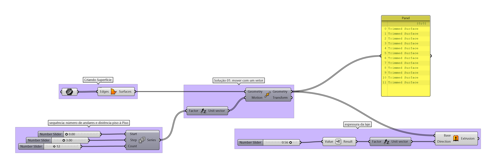
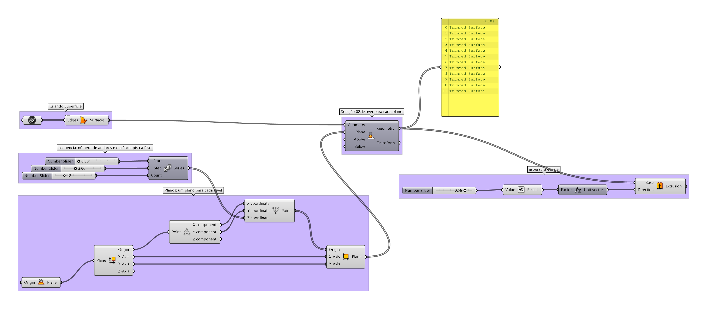
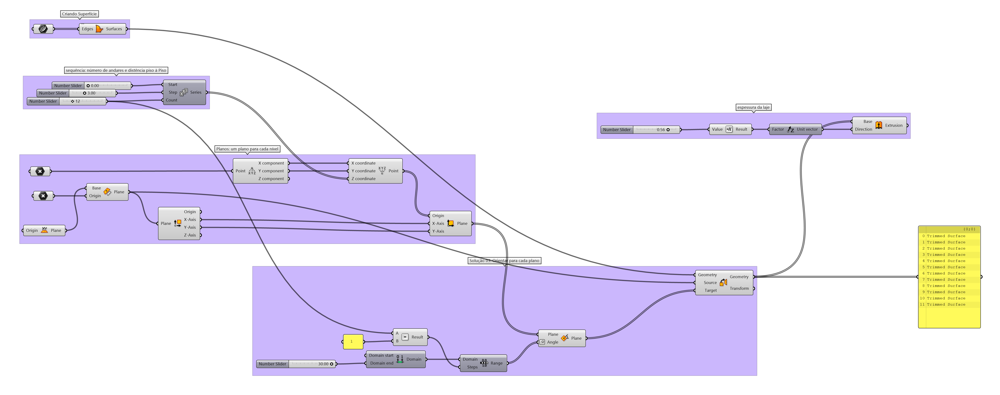

# Múltipos pavimentos

____________
## Solution 01

[example 01](./multipav_base_op_01.gh)

____________
## Solution 02

[example 02](./multipav_base_op_02.gh)

____________
## Solution 03

[example 03](./multipav_base_op_03.gh)

_____________
_____________