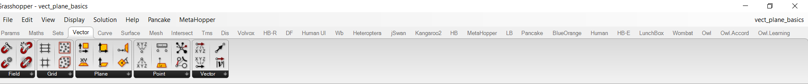
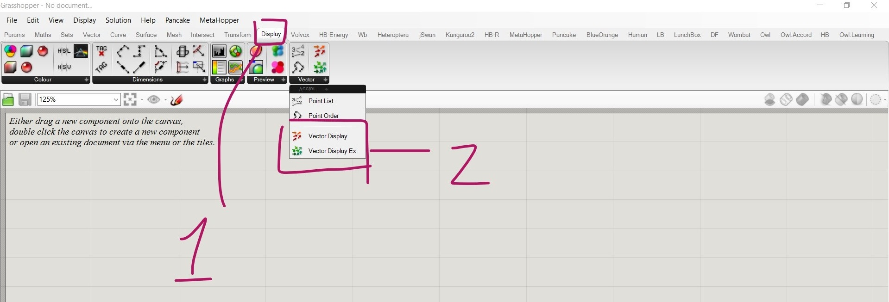
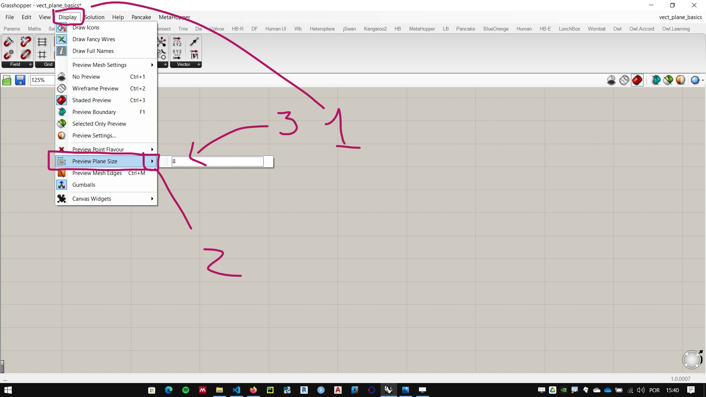
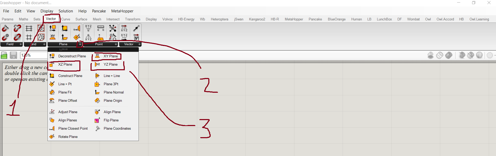

# Points, Vectors and Planes

[example files](./vect_plane_basics.gh)

## Vectors and points

### Elements of a Vector 
    - Module or Amplitude
    - Direction
    - Sense

### Coordinates of the points and components of a vector

 How points and vectors are represented in the Cartesian plane?
 
 ### Viewing vectors in Grasshopper

### Operations with vectors and points
    - sum 
    - subtraction
    - cross product
    - dot product

## Planes

1. Adjusting Planes visualization

    

1. Main construction planes (XY, XZ e YZ)

    

1. Creating planes

1. Deconstructing planes

