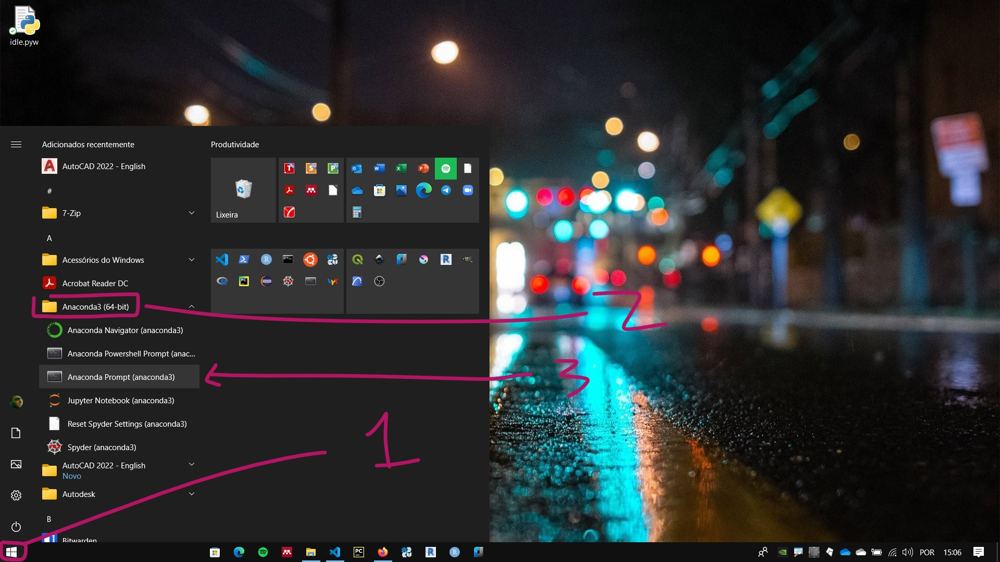
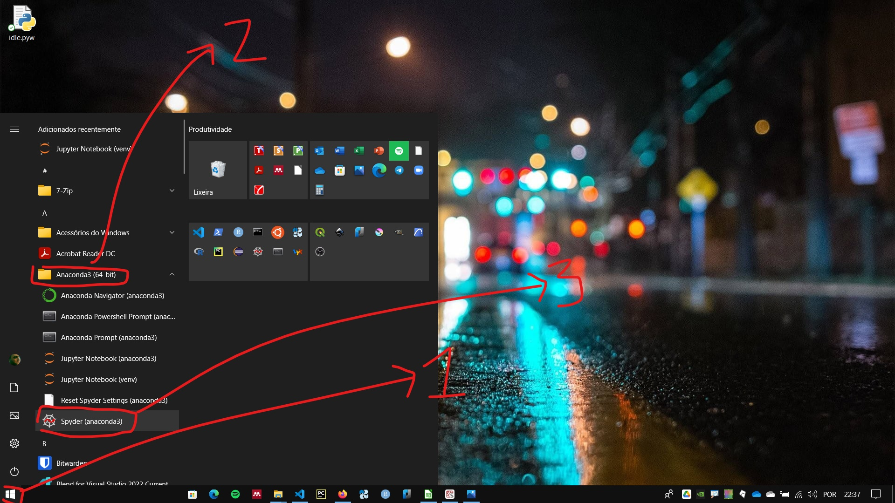
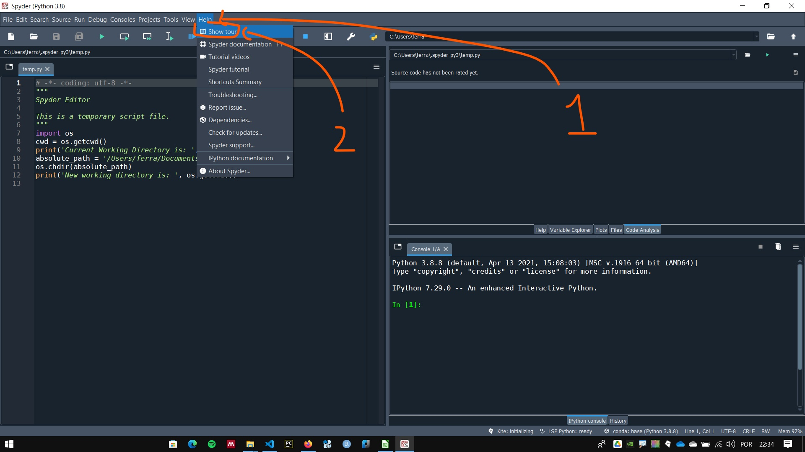

# Using the Spyder IDE

## Updating Spyder

Open the anaconda Prompt: 

    1. Windows start menu -> anaconda folder -> Anacnda Prompt



In the anaconda prompt type the command line below:

``` conda update anaconda ```

This command line will update the anaconda environment. Follow the instructions.


To update Spyder, type the command below and follow the instructions:

``` conda update spyder ```

## Spyder interface

To launch the Spyder IDE go to:

    1. Windows start menu -> anaconda folder -> Spyder



In the first run of the IDE, a message will pop-up asking if you want to take an interface tour. If you don't see this message and want to see the interface tour, go to:

Help -> Show tour




