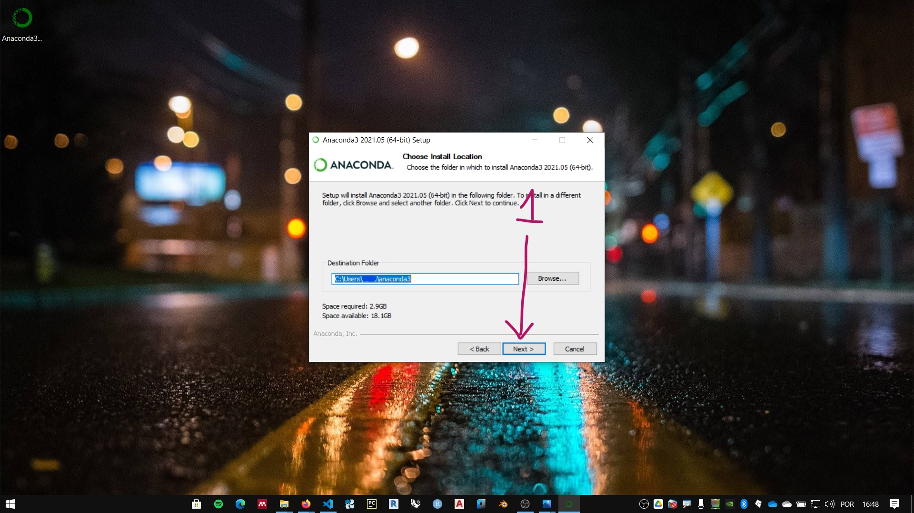
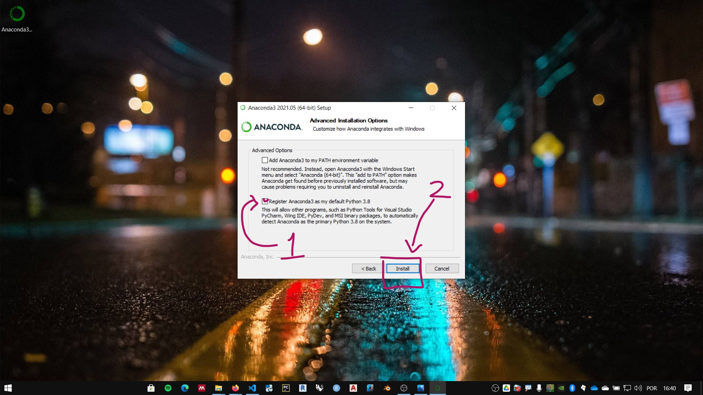

# Installing Python

The official Python distribution is called CPython, and is available  at [Python.org](https://www.python.org/). Although there are rich materials about language in that link, in this course we will use the **Anaconda distribution..

## Installing Anaconda

**Anaconda** is a Python distribution oriented to scientific programming and data analysis. The official distribution page is [anaconda.com](https://www.anaconda.com)

 The installer of the individual editions (free of charge) can be downloaded from the link: [https://www.anaconda.com/products/individual](https://www.anaconda.com/products/individual). Or in the menu **Products**, option **Individual Edition**.

Click the download link to download the installer. Be sure to download the executable compatible with your operating system.

## On Windows

Follow the instructions:

1. run the onstaller:
    
2. Click **I Agree**.
    
3. Install for the current user of the computer or for all users. The default is for the current user only **(just me)**. Choose your option and click **Next**.
    
4. Choose instalation folder and click next **Next**.
    
5. Installation options. It is not recommended to check the first option. You can select the second option. click install and wait for the end of the process. 
    

#### END
