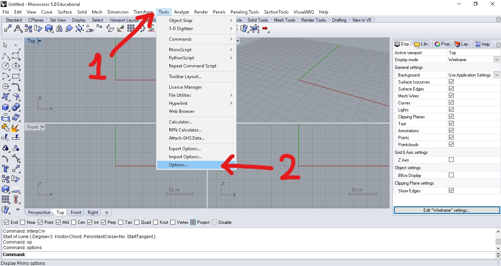
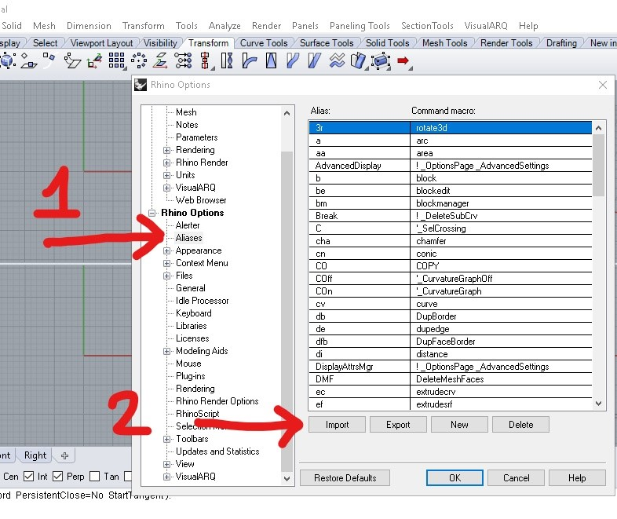
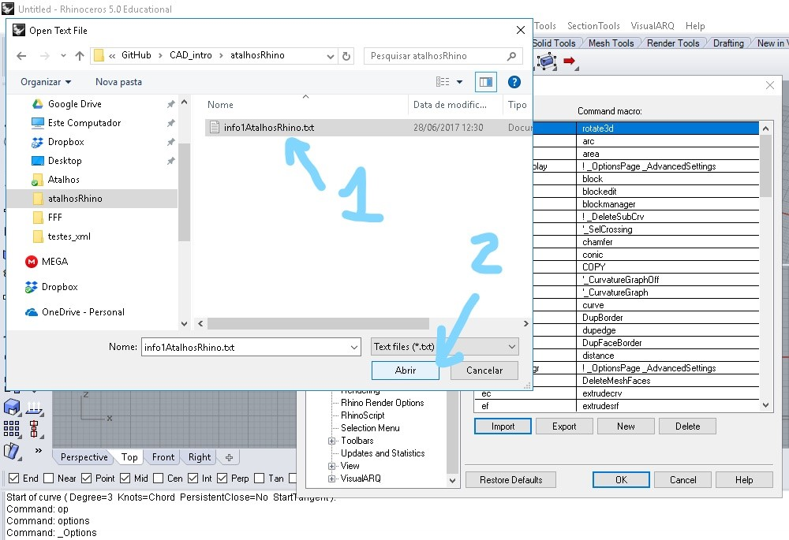

# Aliases and Keyboard configuration

### Download aliases file:

[Atalhos](./aliases.txt)

1. Go to menu **Tools**
2. Go to **Options**

3. Inside **Rhino Options**, choose **Aliases** 
4. Clck **Import** button.

Go to the folder where you have saved the aliases file and click **Open**

List of imported aliases commands and their relation with **Autocad** default aliaes:

[imported aliases list](./atalhosCadRhino.pdf)
