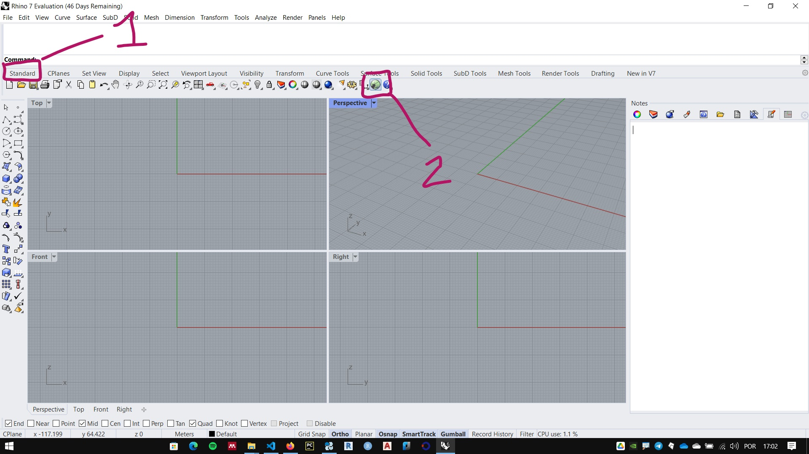
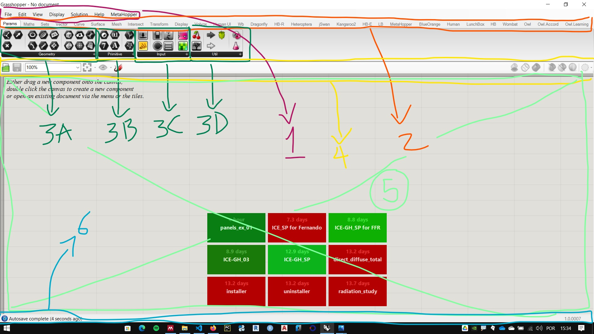
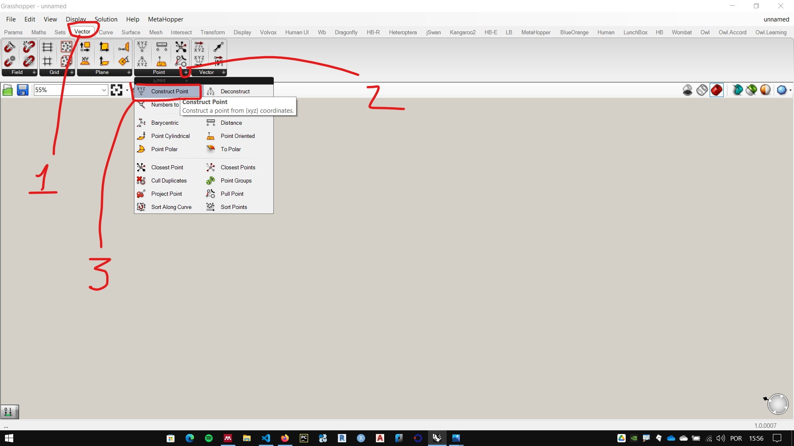
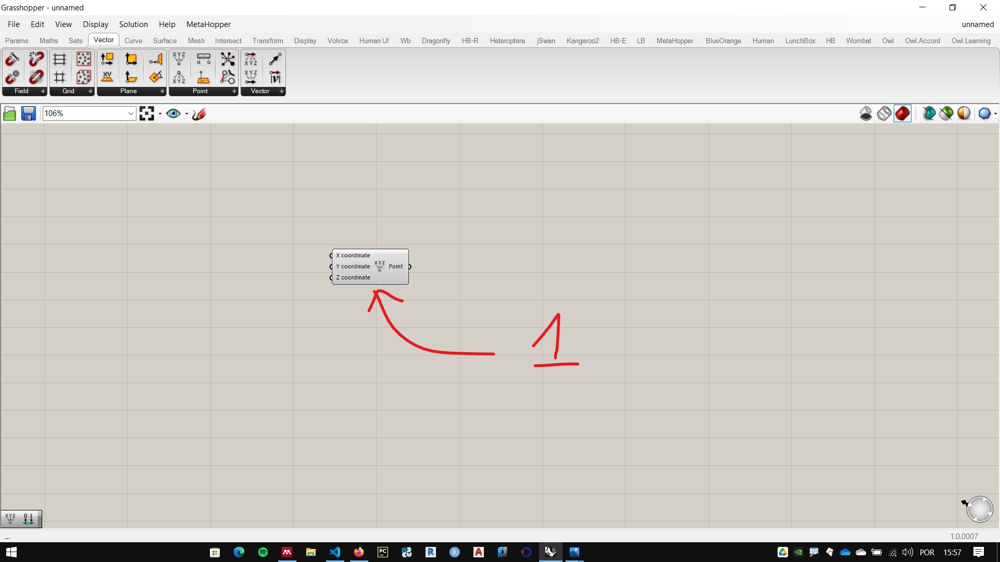
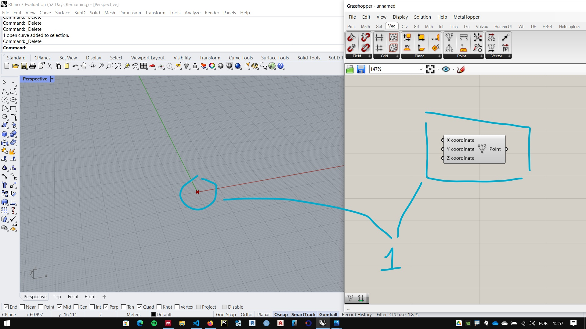
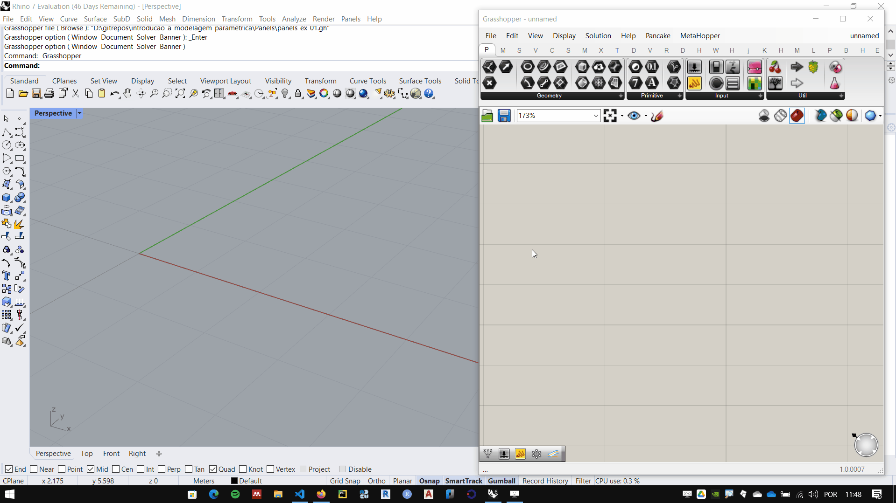
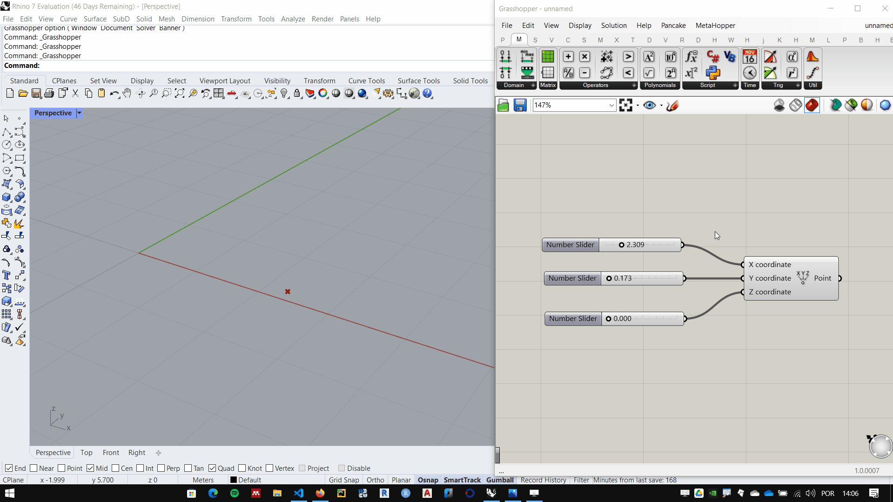
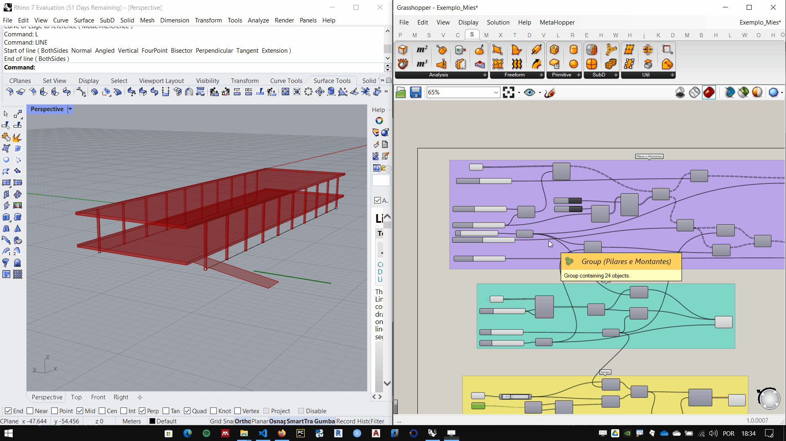

# Interface

**Grasshopper** is a tool that adds parametric capabilities to **Rhino 3D**. It´s a graphical scripting interface.
_______________
## Opening Grasshopper Window

To start **Grasshopper**, there are two options:

 1. type **Grasshopper** on the **Rhino**command line
 1. Click the **Grasshopper** icon on the **Rhinoceros** **Standard** tab, as shown below:

____________

## Interface do Grasshopper

1. Main menu
2. Tabs
3. Component palettes.
4. Canvas toolbar
5. Canvas
6. Status bar

**GrasShopper** componetes are organized in tabs. Each tab contains one or more palettes that house the components (sometimes called batteries) of **Grasshopper**.

____________
## Inserting a component

 To insert a component, go to the component tab and panel that houses the component. In the figure below we use the component **Construct Point**, in the tab **Vector** palette **Point**, component **Construct Point**.

After clicking on the component, click somewhere in the **Canvas** to insert the component

We can see the point marked at the 0.0,0 coordinate on the **Rhino** screen. This mark is generated by the **Construct Point** component.

_____________________
## Connecting and disconnecting components

The point created by the **Construct Point** component can be modified in several ways, one of which is through the **number sliders**. By inserting **Sliders** into the entry of the point coordinates you can parametrically change the point position on the screen. To connect one component to another, simply drag the output of the first component to the next component input

To disconnect there are 3 ways:
 1. right-clicking on the entry you want to disconnect, in the **disconect** option select the component you want to disconnect.
   
 2.Holding ctrl key, drag from one end to the other of the **wire** you want to disconnect.
 
 1. If you want to disconnect one component to connect another, simply drag from the input to the output of the new component without pressing any key. thus, the current connection is undone and the new one is made.

___________________

## Helpful tip:
### Ctrl + alt + left mouse button hold

If you want to know which tab/palette a component used in an algorithm is housed, press the Ctrl + ALt keys and click and hold the left mouse button on the component. The **Grasshopper** interface will show you where the component is.

___________
___________

