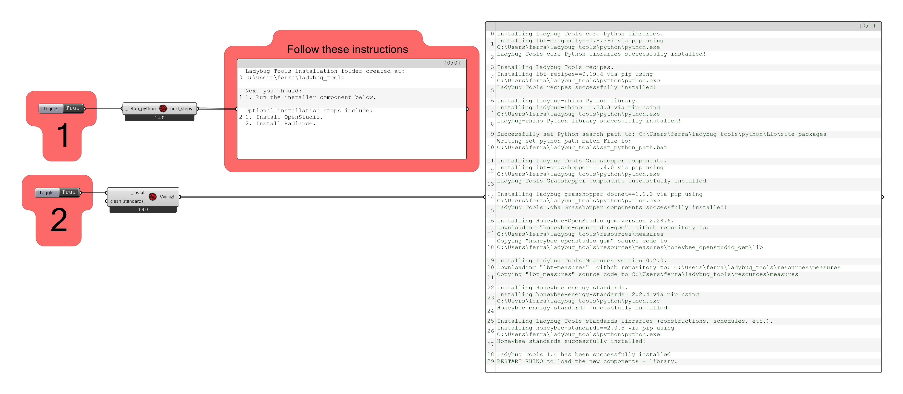

# Installing


## Download Installation files

[Food4Rhino Ladybug Tools Page](https://www.food4rhino.com/en/app/ladybug-tools)


## Read the installation instructions

[Installation Instructions Page](https://github.com/ladybug-tools/lbt-grasshopper/wiki)

Follow the installation instructions for you operating system



### Important folders in Ladybug instalattion:

- Ladybug tools: 
        ``` %userprofile%\ladybug_tools ```
- **Grasshopper** **Plugins** Folder: 
        ``` %APPDATA%\Grasshopper ```
- EPW download folder:
        ``` C:\ladybug `

## Install Optional softwares

Follow the [optional steps](https://github.com/ladybug-tools/lbt-grasshopper/wiki/1.1-Windows-Installation-Steps#optional-steps) of the installation to Install Radiance, Open studio and URBANopt CLI. Those softawares are important to run properlly certain components in **ladybugtools**.

Look for the [compatibility matrix](https://github.com/ladybug-tools/lbt-grasshopper/wiki/1.4-Compatibility-Matrix#compatibility-matrix) for the proper versions for Those softawares.

1. Clique in the link of the software on the compatibility matrix. This will redirect you to the download pega of the xpecific version.
2. In the download page, scroll to the bottom and look for the assets section.
3. In the assets section, look for the installer for your operating system.
4. Download and run the installer, run and follow the instructions.