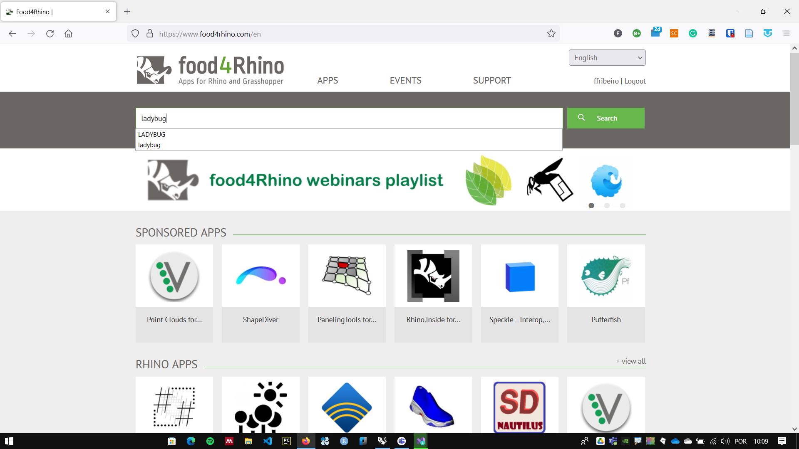
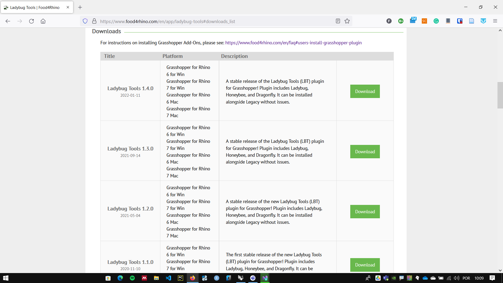

# Installing

You have to follow some steps to install Ladybug tools in **Grasshopper**.

## Download Installation files

!!! warning

    You need to have a free account in Food4Rhino to download the installer.


The Ladybug tools installer is available  in the [Food for Rhino](https://www.food4rhino.com) page



Search for **Ladybug** and download the most recent version of **Ladybug tools**



Alternatively, you canDownload ladybug from the link below:

[Food4Rhino Ladybug Tools Page](https://www.food4rhino.com/en/app/ladybug-tools)


## Read the installation instructions

Read the instructions on the [Installation Instructions Page](https://github.com/ladybug-tools/lbt-grasshopper/wiki).

Follow the installation instructions for you operating system

Basically you need to:

1. unzip the downloaded file
2. Open the installer.gh file on **Grasshopper**

    

3. Turn the Boolean toggle # 1 to True ( by double clicking on the False text)
4. Wait till the component stops running (The False text will be set to True and a message will appear on the panel as shown on the image below).
5. Turn the Boolean toggle # 2 to True ( by double clicking on the False text)
6. Restart Rhino.

    


### Important folders in Ladybug instalattion:

- Ladybug tools: 
        ``` %userprofile%\ladybug_tools ```
- **Grasshopper** **Plugins** Folder: 
        ``` %APPDATA%\Grasshopper ```
- EPW download folder:
        ``` C:\ladybug ```

## Install Optional softwares

Follow the [optional steps](https://github.com/ladybug-tools/lbt-grasshopper/wiki/1.1-Windows-Installation-Steps#optional-steps) of the installation to Install **Radiance, Open studio** and **URBANopt CLI**. Those softawares are important to run properly certain components in **ladybugtools**.

Look for the [compatibility matrix](https://github.com/ladybug-tools/lbt-grasshopper/wiki/1.4-Compatibility-Matrix#compatibility-matrix) for the proper versions for Those softawares.

1. Clique in the link of the software on the compatibility matrix. This will redirect you to the download page of the specific version.
2. In the download page, scroll to the bottom and look for the assets section.
3. In the assets section, look for the installer for your operating system.
4. Download and run the installer, run and follow the instructions.
5. is recommended to install **Radiance, Open studio** under the ``` %userprofile%\ladybug_tools ``` folders:
   1. ``` C:\Users\[username]\ladybug_tools\Radiance ```
   2. ``` C:\Users\[username]\ladybug_tools\openstudio ```


## Cheking instalation

To check the insalation, download the [install_check.gh], or use the Honeybee components and panels as in the image below:


__________
__________
