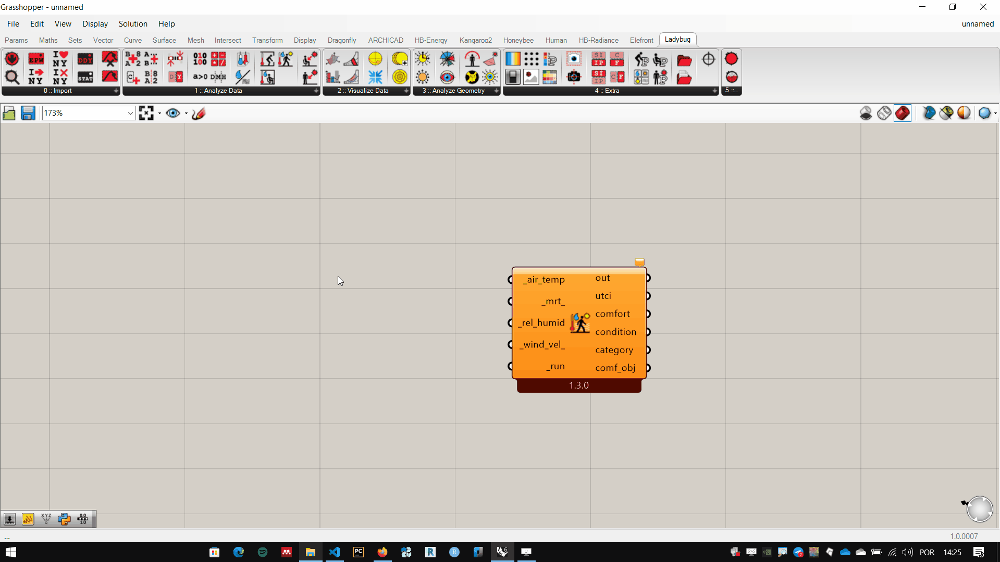
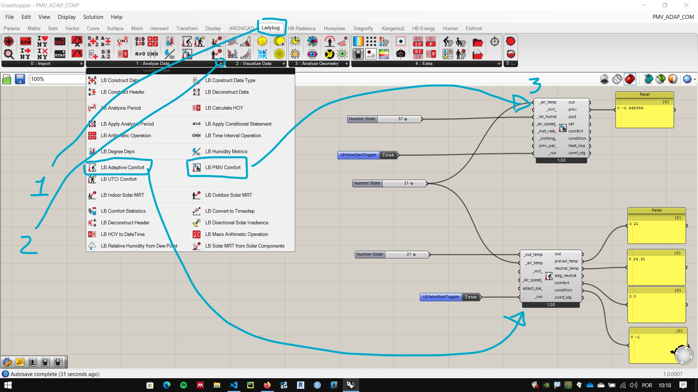
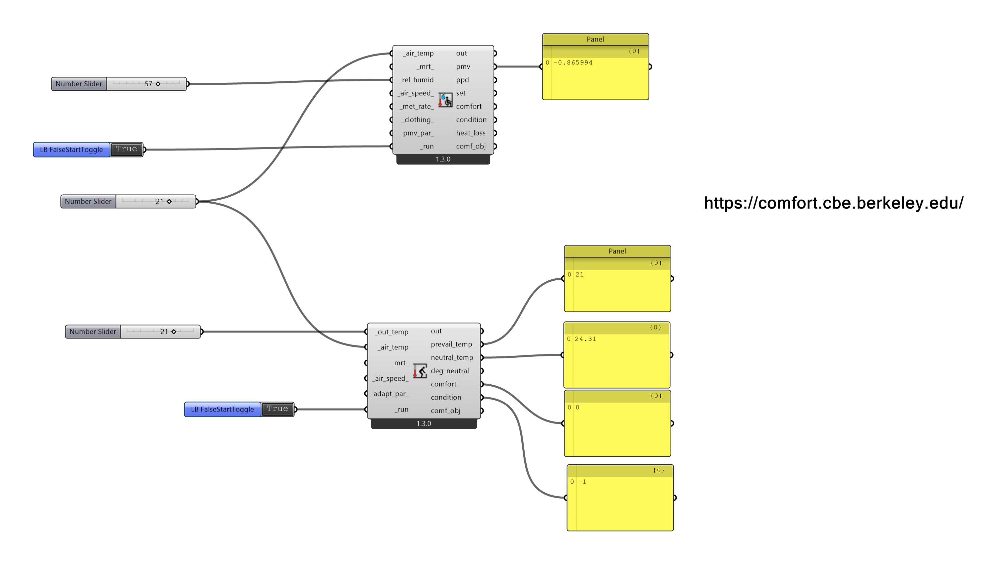

# Interface Básica

## Universal Thermal Climate Index 

1. Thermal comfort analysis (outdoor) To illustrate how the plug-in works, let's use the **Ladybug UTCI Calculator** component ! [UTCI] (.\UTCI_00.jpg)
   
1. Entries By grasshopper's default the inputs are on the left side and the outputs on the right side of the components. Entries can be required or optional.

1. Mandatory Entries By convention, all required entries of LadyBug components have their names starting with a character "_". For this component the mandatory ones are: 1. Dry bulb temperature [*_air_temp*](https://en.wikipedia.org/wiki/Dry-bulb_temperature)

1. Relative humidity [*_rel_humid*](https://en.wikipedia.org/wiki/Relative_humidity)

1. ***_run*** By connecting a numeric value to the *_air_temp* and *_rel_humid* entries, the component has enough information to calculate UTCM, but you must place a Boolean value **True** in the *_run* entry.

     

1. Entries with _ (**underscore character**) at the beginning and end of the name are optional, having default values that are used when no information is given.

   1. mean radiant temperature [*_mrt_*](https://en.wikipedia.org/wiki/Mean_radiant_temperature)
   2. *_wind_vel_*

[example file](./utci.gh)

## Predicted mean vote (PMV) e adaptive comfort

[Online Calculator](https://comfort.cbe.berkeley.edu/) of thermal confort from the **Center for the Built Environment (CBE)** of Berkley university.

### PMV

Article in [designing buildings](https://www.designingbuildings.co.uk/wiki/Predicted_mean_vote) about PMV

Article about  [PMV e PDD](https://www.simscale.com/blog/2019/09/what-is-pmv-ppd/)

### Adaptive comfort

[Adaptive Comfort](https://cbe.berkeley.edu/research/adaptive-comfort-model/) at **Center for the Built Environment (CBE)**, Berkley University.

Article about [Adaptive Comfort](http://petersimmonds.com/thermal-comfort/).

### Ladybug components

[Example Grasshopper File](./PMV_ADAP_COM.gh)

___________
___________
