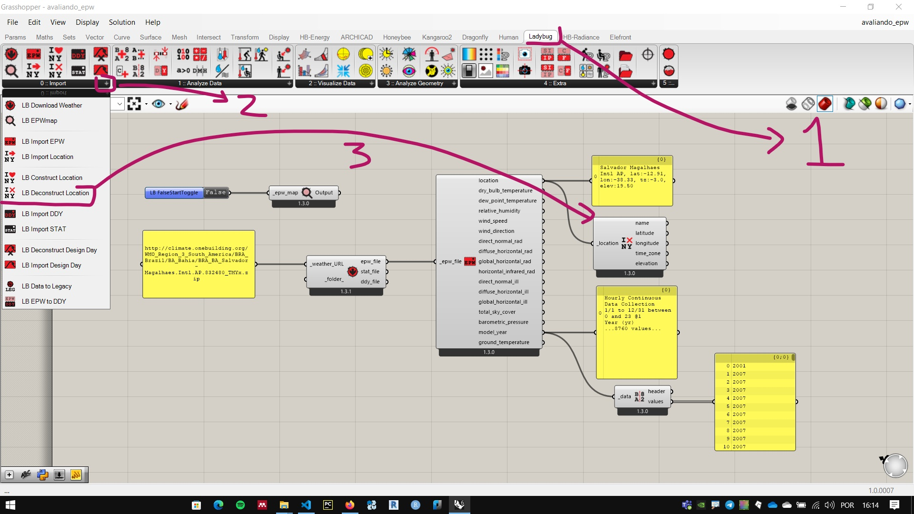
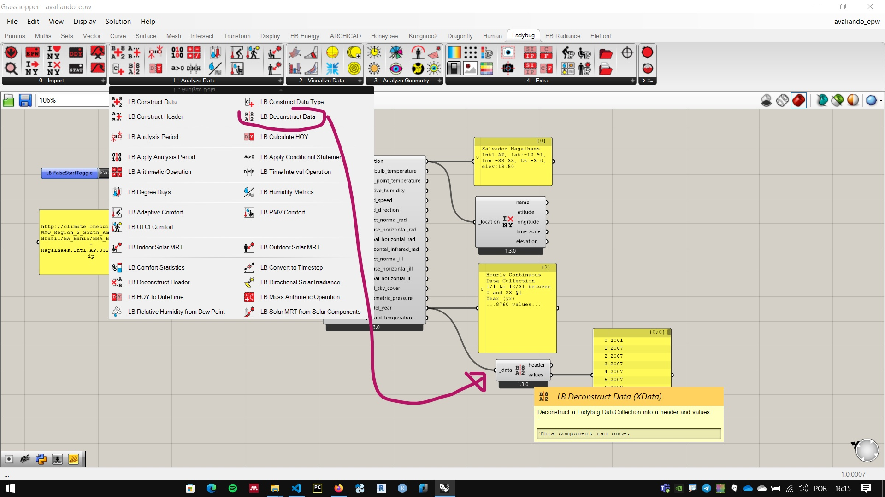
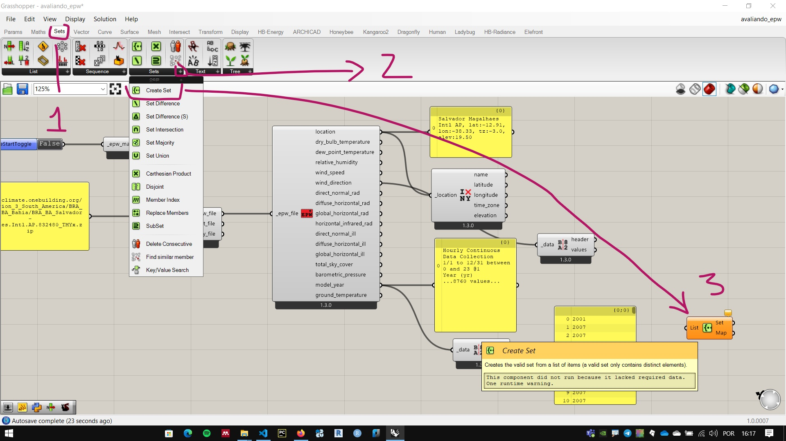
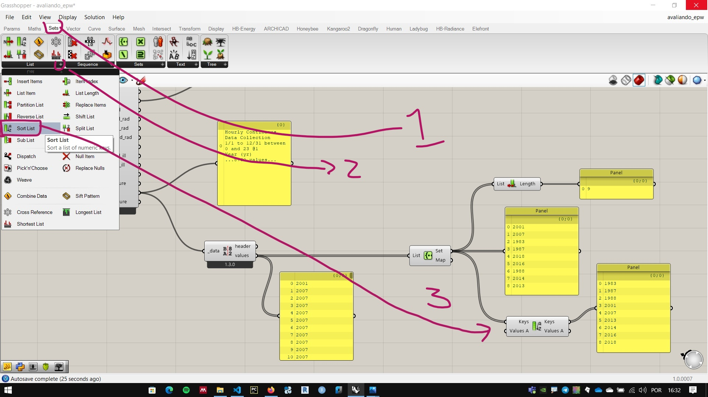
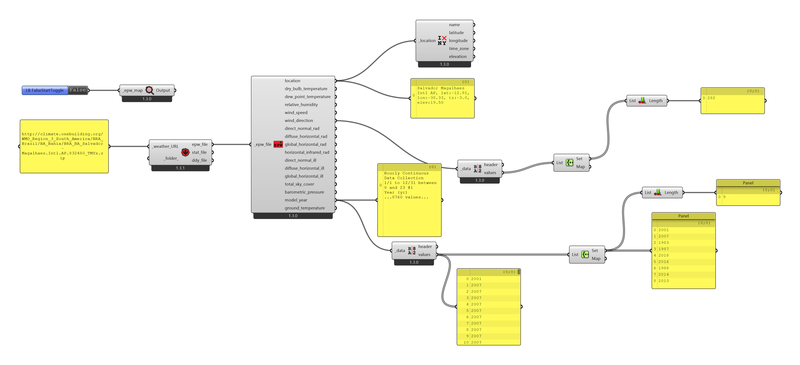

# Evaluating data from the epw file 

In some cities we can find several epw files. Each containing information collected by a different weather station.

An appropriate data set is critical to any analysis and simulation.

One of the information contained in an EPW file is in the location data. These can be accessed by the **LB Deconstruct Location** component.

Below the output **Location** we have the weather data in sequence, with the exception of the penultimate output: **modelYear**, which shows the years in which the data were collected to create the standard temperature model during the year.

The outputs of epw files often combine textual data and values. The other components of the Ladybug Tools * plugins can separate the textual data from the values automatically. But to use the values in other Grashopper components it is useful to use the **LB Deconstruct data** component.

O componente **create set** ajuda na análise de longas listas de informação. A saída **set** apresenta apenas os valores únicos. Neste caso, podemos ver a lista de anos utilizada para modelar os dados.

You can sort the output information using the **Sotr List** component.

Sorting and extracting unique values are recurring operations in data analysis.

Similar operations can be performed at the exit **windDirection_** to check the directions in which the wind was measured. Some stations use only cardinal points, other stations also use collateral and others use more directions.

### Final Configuration

[final file](./eval_epw.gh)

