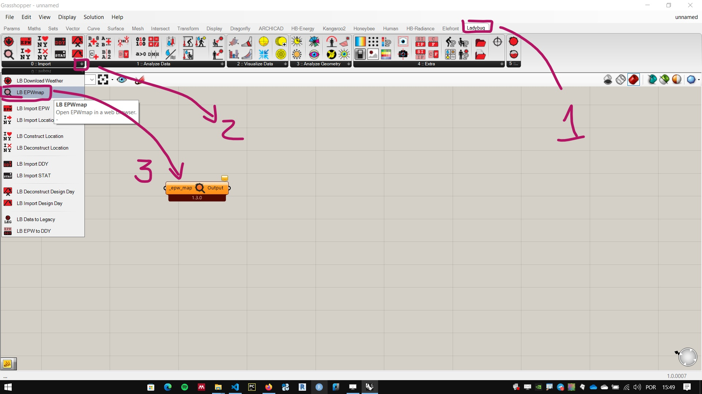
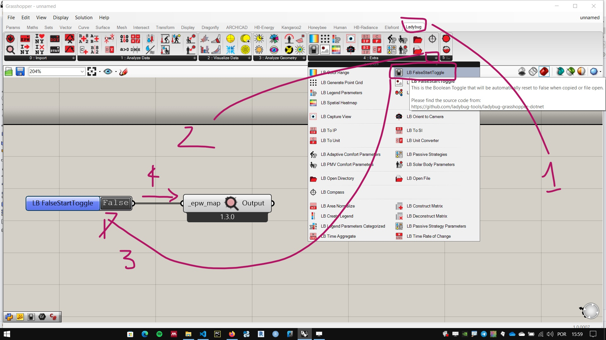
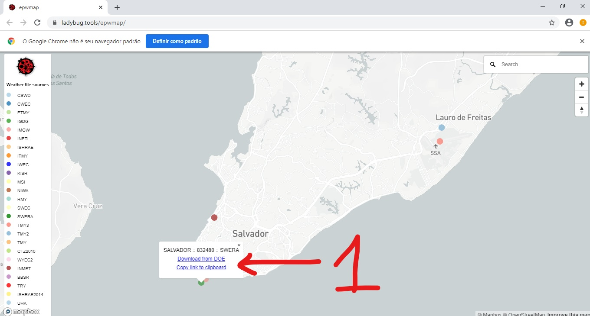
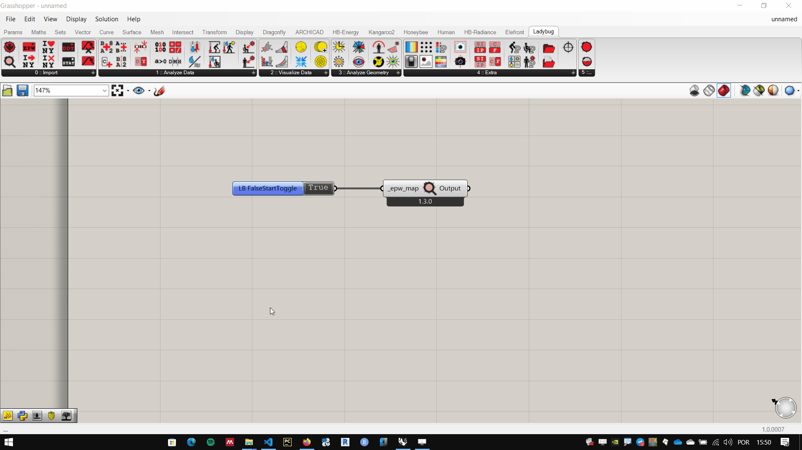
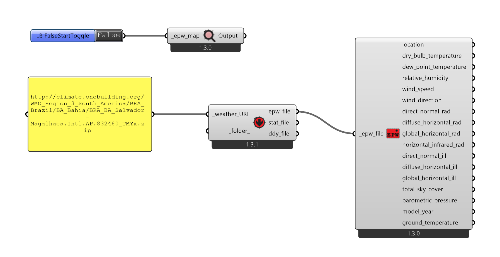

# EPW Files

[About Energy Plus EPW files](https://energyplus.net/weather/simulation)

## Downloading EPW files

Use **LB EPW Map** component, in tab **Ladybug**, pallet **0::Import**.

In the **LB EPW Map** input , connect a **Boolean toggle** or a **LB FalseStar toggle**, in pallet **04::Extra**.

The **LB FalseStar toggle** component works the same as a **Boolean toggle** component, the difference is that it is automatically adjusted to **False** every time the file is opened. This behavior is interesting in many of the components of **Ladybug Tools**.

### Look for the stations closest to the locality of your climate study.

1. Clique em cima da estação desejada e escolha a a opção que copia o link

    !!! warnning
    
        If you used a **Boolean Toggle** standard **Grasshopper**, remember to disable the Boolean connector after copying the file path.

2. Copy the link to a Grasshopper panel. Use the panel as input for the **LB Download Weather** component

3. The **LB Download Weather** makes the file information available for manipulation in Grasshopper. Connect the **epw_file** output of **LB Download Weather** in the input of a component **LB Import EPW**, tab **Ladybug** palette **0::Import**.

### Final configuration

[final file](./ladybug_epw.gh)

_________________________
_________________________

