# Stochastic optimization.

________________________________________________

## Understanding the problem

[theorical example 3dm](./galapagos_exemplo_teorico.3dm)

[theorical example gh](./galapagos_exemplo_teorico.gh)

_________________________________________
### HILL CLIMBING method

#### Undestending the method

#### Goal

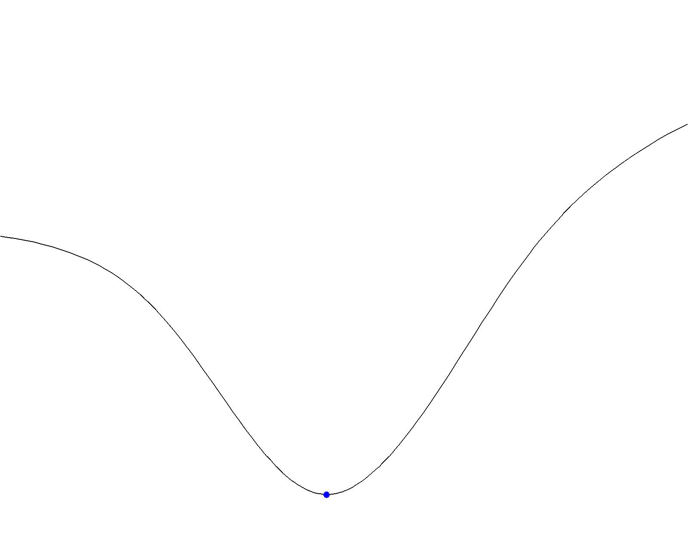

#### Limitations

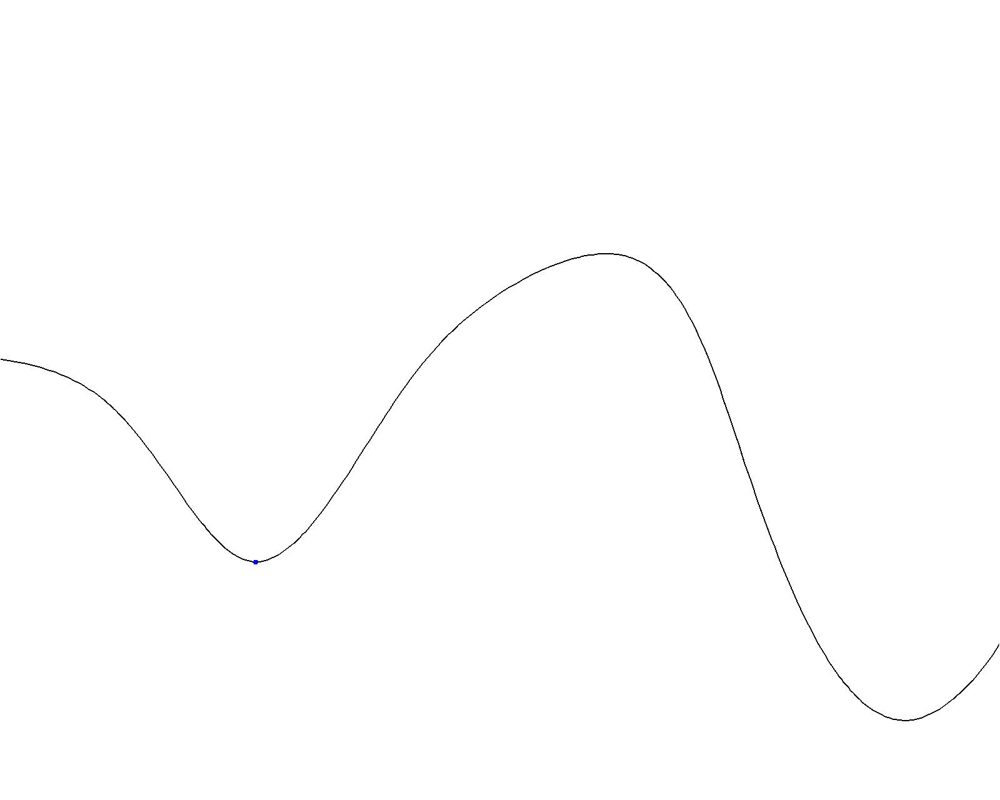

_______________________________________

### Local and Global maximum and minimum 

###### source: https://upload.wikimedia.org/wikipedia/commons/6/68/Extrema_example_original.svg

### Multivariate problems

[source](https://en.wikipedia.org/wiki/Test_functions_for_optimization#Test_functions_for_constrained_optimization)

_________________________________________________________

## [Evolutionary Algorithms](https://en.wikipedia.org/wiki/Evolutionary_algorithm)

### Algoritmos Genéticos

1. #### Fitness function
1. #### Genes
1. #### Population
1. #### Generations
2. #### Inbreeding
3. #### Mutations

#### Galapagos Solver

[arquivo 3dm](./OTIMIZA_EXEMPLO.3dm)

[arquivo gh](./galapagosLadyBug.gh)

The Galapagos component is in the tab **Params**, section **uitl**.

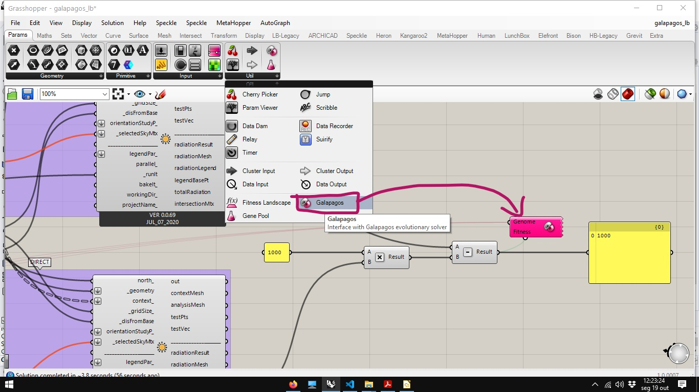

The most practical way to indicate optimization parameters for the algorithm is: first select all the **sliders** you want to optimize.

Then right-click on the **genome** input of the **Galapagos** component and choose the **Selected Sliders* option

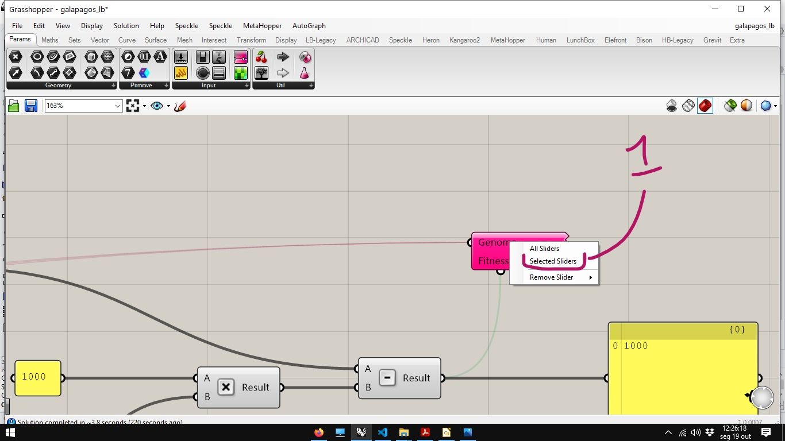

To indicate the value to use as a fitness function, you must drag the connection from the Galapagos component input to the output that displays the value to be optimized.

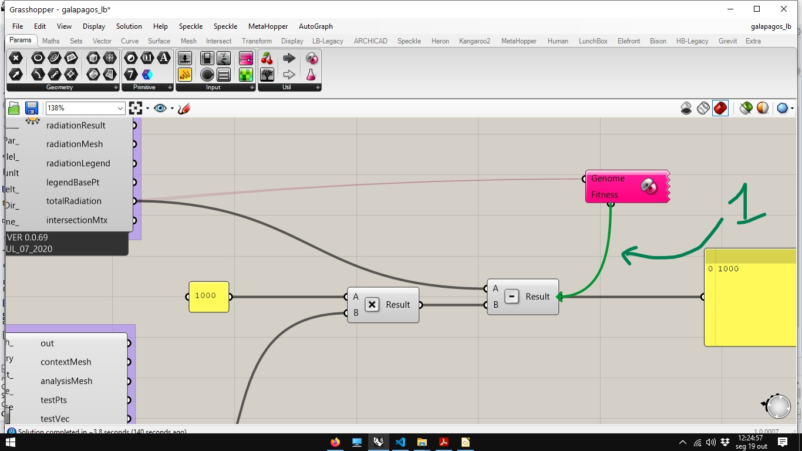

Double-click the **Galapagos** component icon to open the *solver* editor.

#### Running the simulation

*Galapagos Editor* has 3 tabs: Options (to configure the analysis), Solver (to run the simulation) and Record (where a step-by-step record of a simulation is recorded). In options we can configure: 

1. If the algorithm will search for a maximum or minimum location.
1. How many generations can be generated without evolution in the function of aptitude.
1. The size of the population 4. How many times the initial population will be increased in the first generation
1. The percentage of individuals to be maintained according to the criterion of the aptitude function.
1. Percentage of individuals to be generated from the combination of genes of individuals maintained in the previous generation.

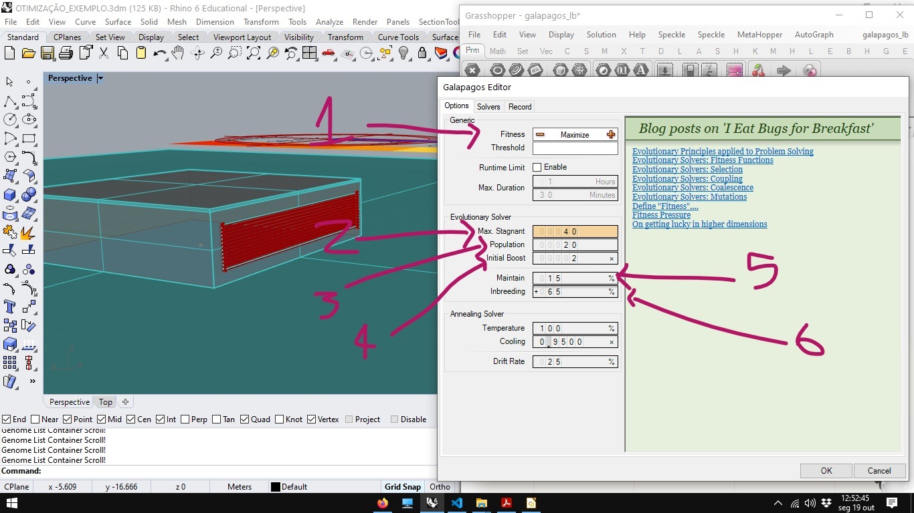

1. Using the genetic solver
1. Start optimization 3. Generation diagram
1. representation of the population
1. representation of the genome
1. representation of individuals of a generation

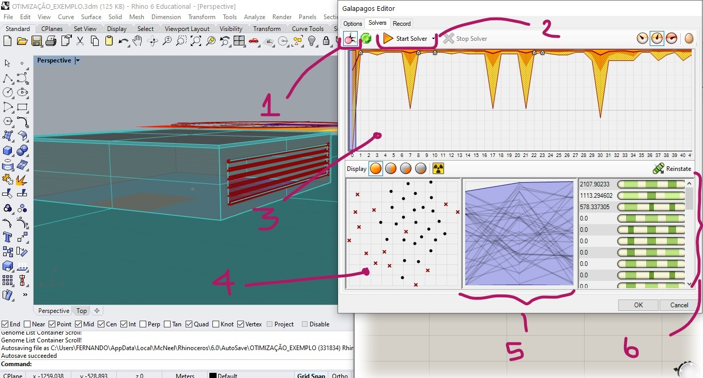

It is possible to select a germ (1) and an individual (2) of a generation and adjust the slidres for the position of this individual (3).

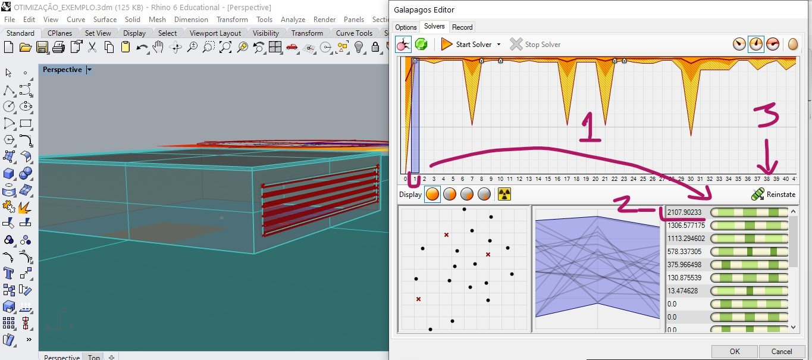

The small + sign in the generation diagram indicates that a new value for global maximum has been found. We can see the maximum value found in generation 8 in the image below

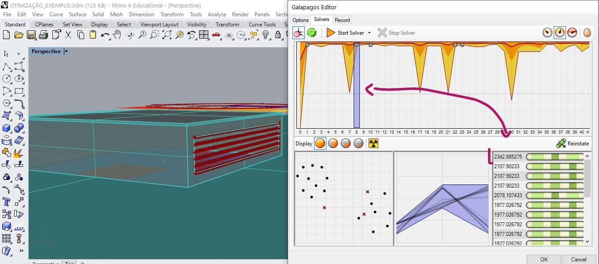

In generation 10, another maximum value was found.

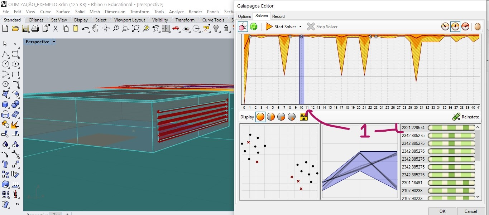

In generation 22 a new global maximum candidate was found.

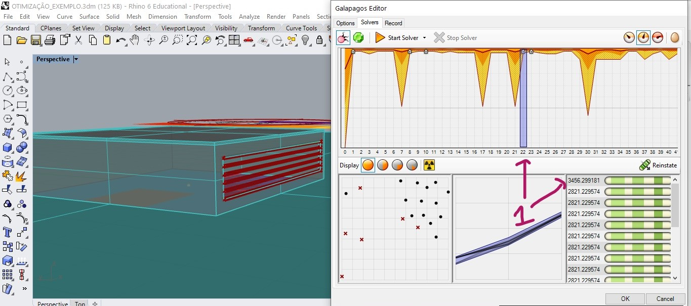

in generation 23 a new value is found.

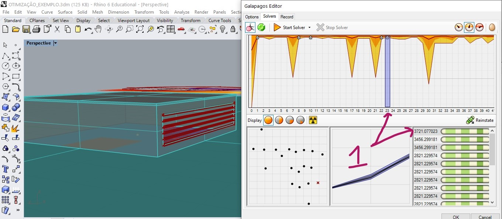

After 40 generations without alternating the value greater than that found in generation 23, the solver reaches its stop condition.

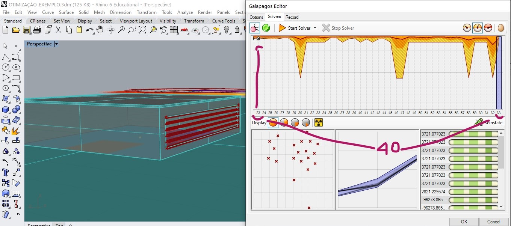  

Below we have a file with a copy of the values recorded during optimization.

[registro da otimização](./RECORD.TXT)